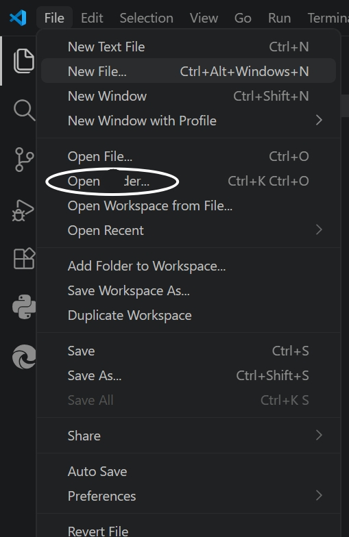
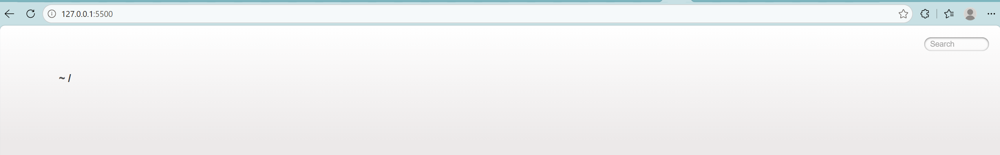
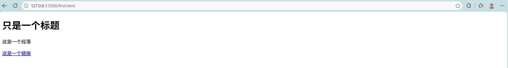

<!DOCTYPE html>
<html>
<head>

<meta charset="utf-8">
<title>菜鸡网</title> 

</head>

<body>
<h4>1.启动 Live Server 之后，浏览器出现 ~/ ，看不到网页。</h4>  
open file（打开单个文件）  <b>vs</b>  open folder（打开文件夹）
 

 
<pre> 1、打开单个文件 open file只是把这一个文件拿出来编辑。
- VS Code左侧资源管理器是空的，看不到同目录别的文件
- Live‑Server 会迷路，找不到网页文件，出现  ~/ 、 Cannot GET  报错</pre>

 
<pre>2、打开文件夹 open folder 写网页必须这个选中你的H文件夹打开。
- 左边会显示完整文件列表，看得见  first.html 、图片、css全部文件 
- Live‑Server把这个文件夹当作网站根目录，正常生成  127.0.0.1:5500/first.html 
- 网页里面引用图片、样式全部正常 </pre> 
 

</body>

</html>
